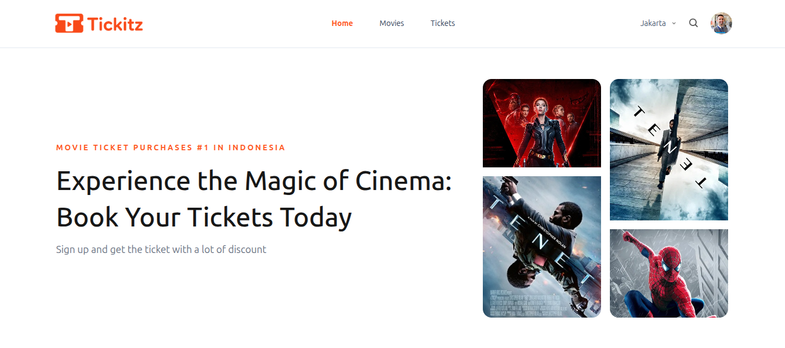
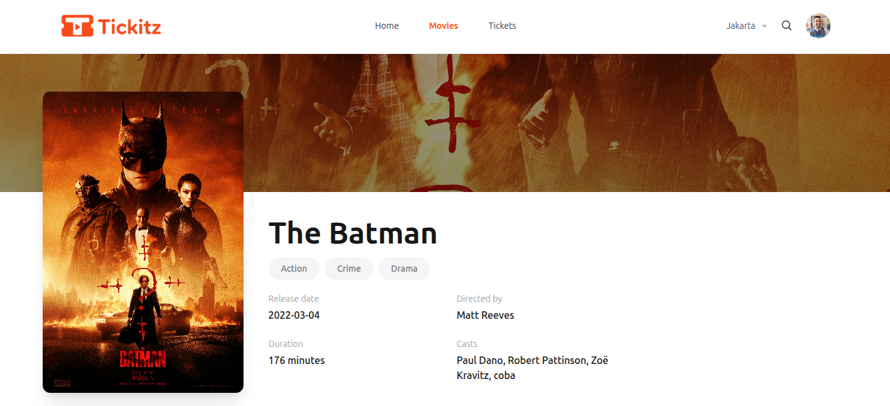
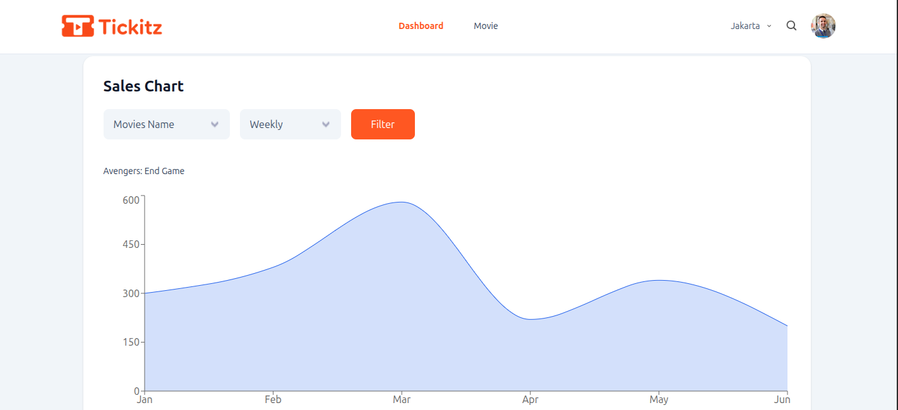

## Logo

<p align="center">
  
</p>

# Tickitz Frontend

[](https://opensource.org/license/mit)

Tickitz Frontend is a movie ticket booking web application built with **Vite, React, and Tailwind CSS**.
This project provides a user interface for browsing movies, viewing movie details, selecting schedules, booking tickets, managing user profiles, and accessing an admin dashboard.

## Preview

### Home Page



### Movie Detail Page



### Admin Dashboard



## Design Philosophy

* Component-driven structure with reusable UI components.
* Mobile-first responsive layout for better user experience across devices.
* Clean and simple interface focused on a fast movie booking flow.
* Consistent styling using Tailwind CSS.

## Tech Stack


## Features

* Movie list page
* Movie detail page
* Schedule and cinema selection
* Ticket booking flow
* Payment page
* User profile page
* Admin dashboard
* Movie management for admin
* Responsive layout for mobile and desktop

## Project Structure

```bash
src/
├── assets/
├── components/
├── layouts/
├── pages/
├── redux/
├── routes/
└── utils/
```

## Environment Variables

Create a `.env` file in the root project folder.

```env
VITE_API_URL=http://localhost:8081
```

## How to Setup

Make sure you have installed:

* Node.js v16 or higher
* npm

## Quickstart

```bash
# clone repository
git clone https://github.com/anggavb/tickitz-frontend.git

# go to project folder
cd tickitz-frontend

# install dependencies
npm install

# run development server
npm run dev

# build for production
npm run build
```

## Related Project

* [Tickitz Backend](https://github.com/anggavb/tickitz-backend.git)

## How to Contribute

1. Fork this repository.
2. Create a new feature branch.
3. Commit your changes.
4. Push your branch.
5. Create a pull request.

## License

This project is licensed under the MIT License.
